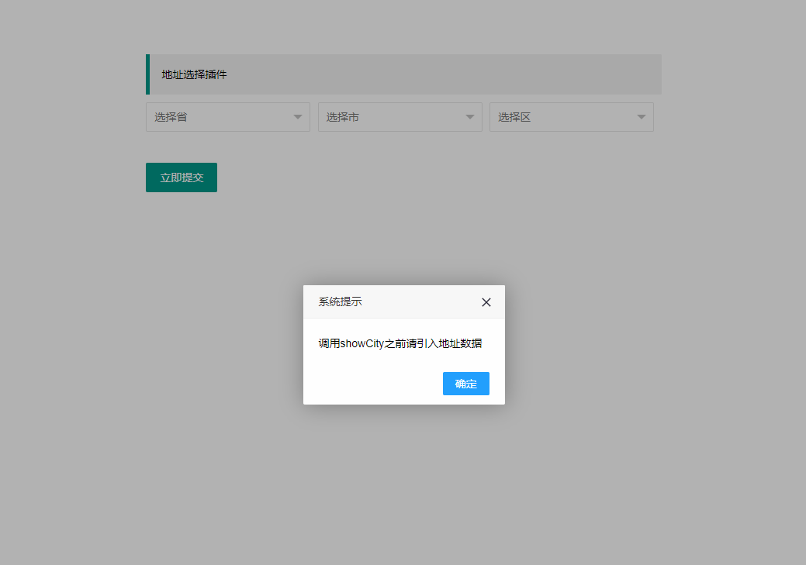

# layui-select-address
	基于layui封装了一个地址选择器，地址数据采用weui的city-picker
## 一、用法
### 1. 需引入city-picker.js地址数据文件
```javascript
<script type="text/javascript" src="js/city-picker.js"></script>
```
如果未引入，则会提示

### 2. layui引入common模块
```javascript
//config的设置是全局的
layui.config({
  base: 'js/' //假设这是你存放拓展模块的根目录
}).extend({ //设定模块别名
  common: 'common' //如果 common.js 是在根目录，也可以不用设定别名
});
```
### 3. 使用模块
```javascript
layui.use(['form', 'common'], function(){
  var common = layui.common,
    form = layui.form;

    //三级地址联动
    common.showCity('province', 'city', 'district');

});
```
